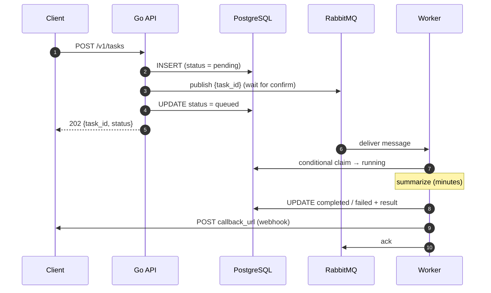
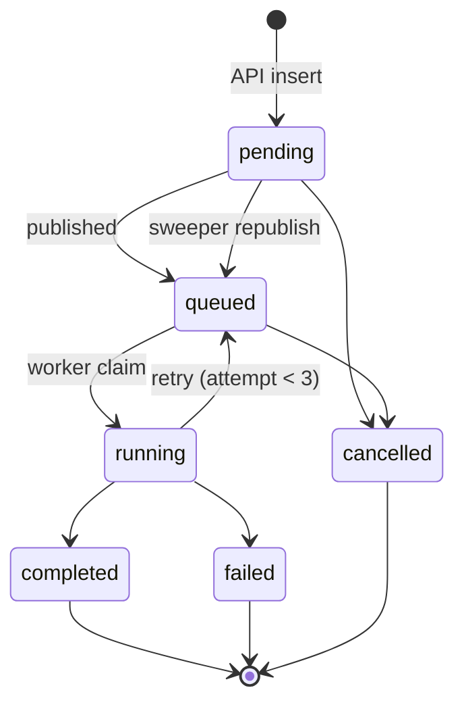
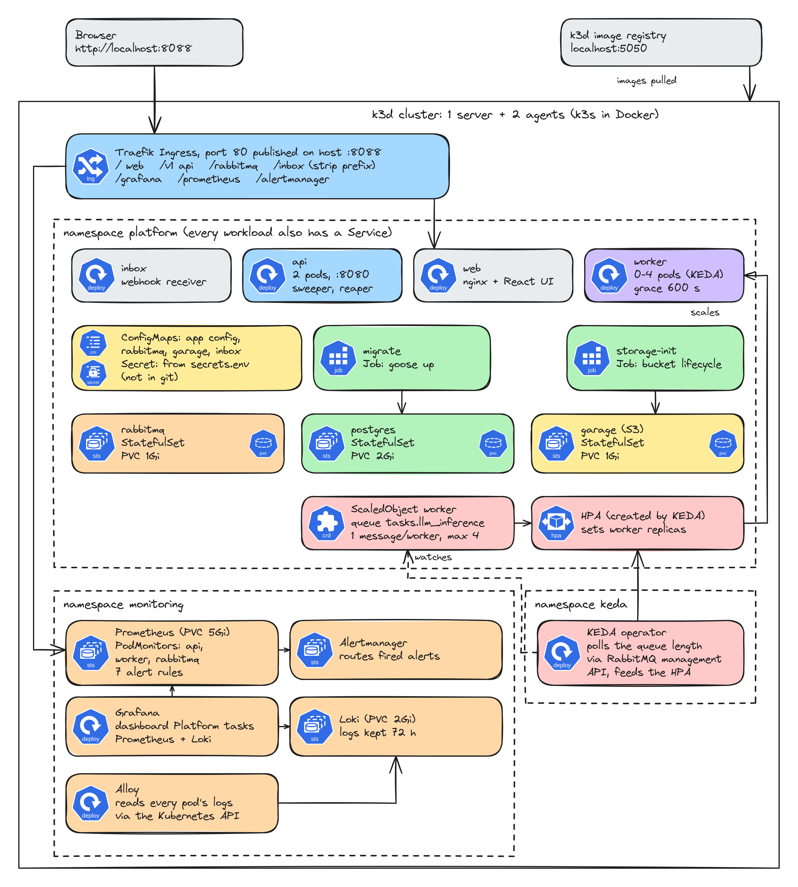
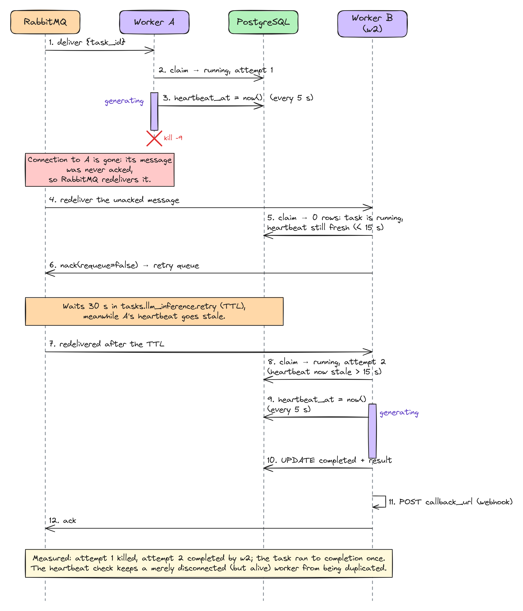
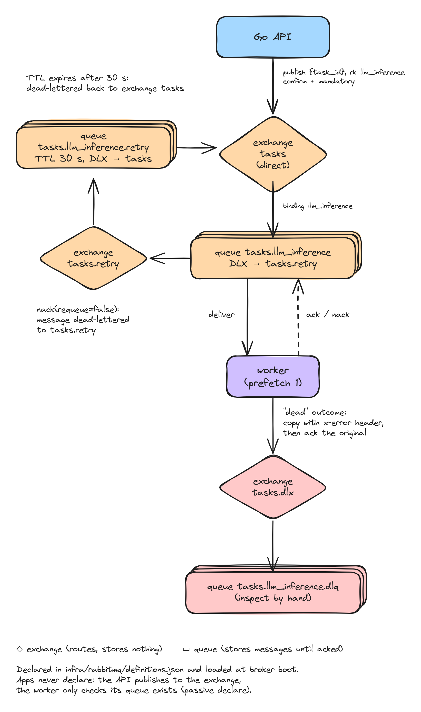
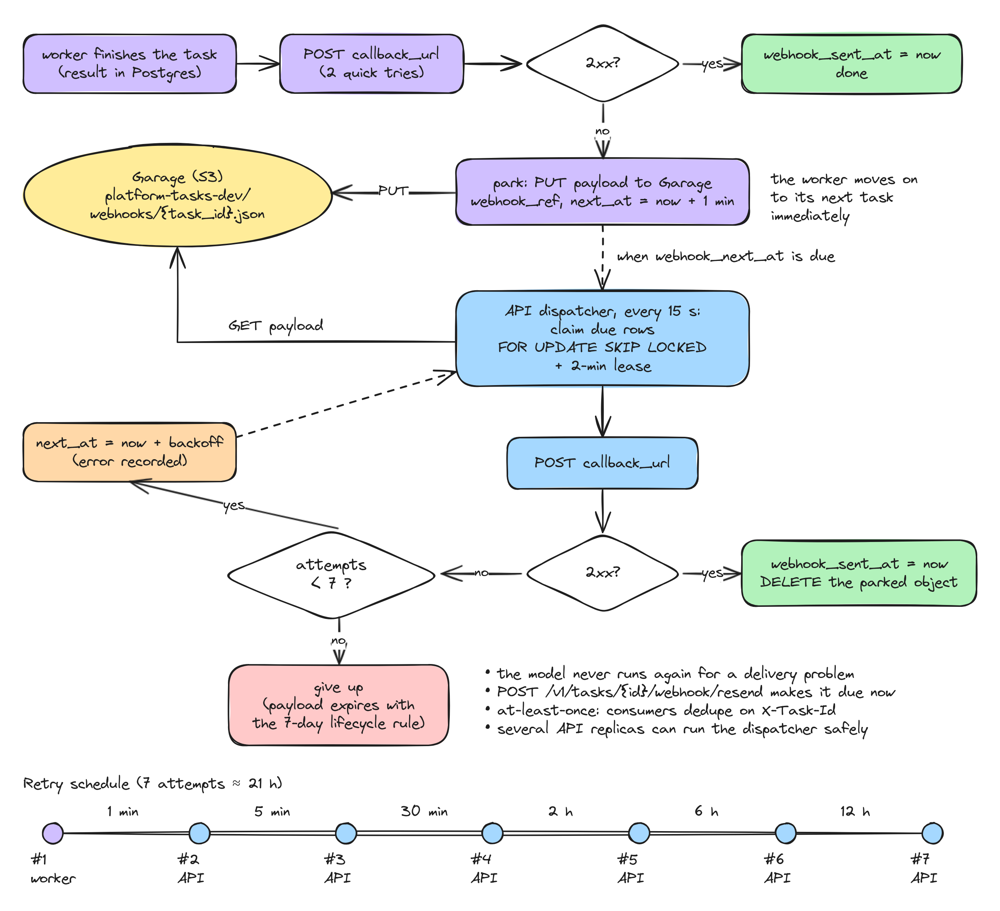
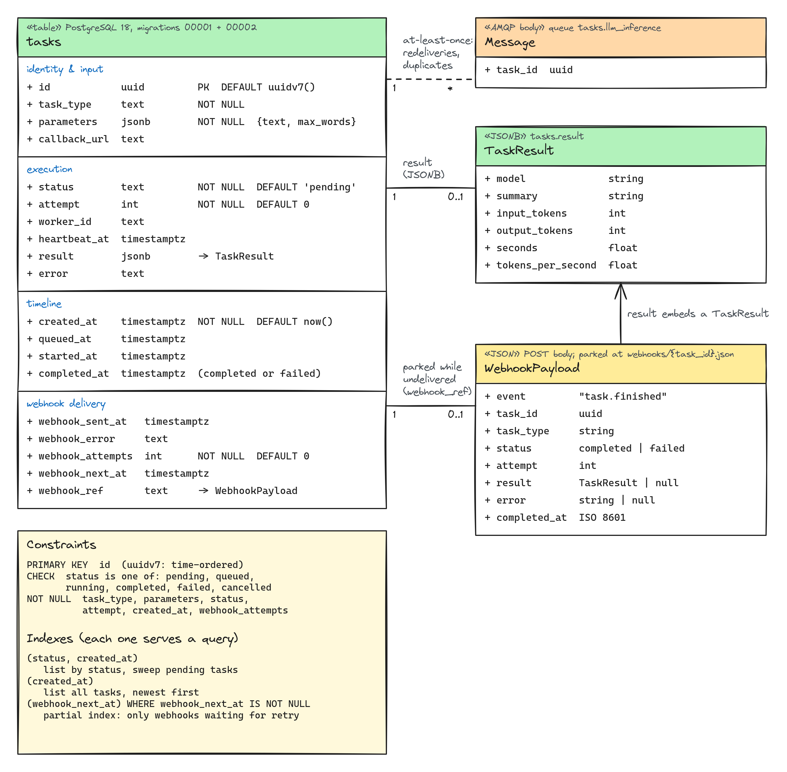

# platform-tasks

Async compute-task platform: a Go API accepts tasks, RabbitMQ queues them, Python workers run LLM inference on CPU, Postgres tracks state, and the client gets a webhook when its task finishes.

## Architecture


## Task lifecycle



## States



## Diagrams

The flowcharts above cover the basic shape. A few things are easier to show than to describe, so they're hand-drawn in [Excalidraw](https://excalidraw.com) — editable `.excalidraw` sources sit next to the PNGs in [`.github/diagrams/`](.github/diagrams/).

### Deployment on Kubernetes

[](.github/diagrams/k8s-architecture.excalidraw)

### A worker dies mid-task: redelivery and heartbeat takeover

[](.github/diagrams/worker-crash-takeover.excalidraw)

### RabbitMQ topology: retries and dead-lettering

[](.github/diagrams/rabbitmq-topology.excalidraw)

### Webhook delivery: park it, retry later, never recompute

[](.github/diagrams/webhook-delivery.excalidraw)

### Data model

[](.github/diagrams/data-model.excalidraw)

## Layout

| Path | What |
|---|---|
| `api/` | Go REST API (`cmd/api` entrypoint, `internal/` packages) |
| `api/migrations/` | goose SQL migrations for Postgres |
| `worker/` | Python worker: consumes the queue, runs the model |
| `worker/models/` | GGUF model files (gitignored, copied into the image) |
| `web/` | React dashboard (Vite + TypeScript + Tailwind) |
| `deploy/k8s/` | Kubernetes manifests (Kustomize): StatefulSets, Deployments, Jobs, KEDA ScaledObject, Ingress |
| `deploy/monitoring/` | Prometheus/Grafana/Loki values, PodMonitors, alert rules, dashboard generator |
| `infra/` | Config for third-party services: RabbitMQ topology (`definitions.json`), Garage (`garage.toml`) |
| `scripts/` | `dev.sh` (whole stack), `webhook_receiver.py` (example client endpoint with an inbox page on :9000) |
| `testdata/` | Sample inputs |

## Run on Kubernetes (k3s via k3d)

```bash
scripts/k8s.sh all          # cluster + images + platform + monitoring (first run: ~10 min)
scripts/k8s.sh build web    # rebuild one component, then: scripts/k8s.sh deploy
scripts/k8s.sh status
scripts/k8s.sh down
```

Everything is behind one address, **http://localhost:8088**, login **admin / admin**:

| Service | URL |
|---|---|
| Web UI | http://localhost:8088/ |
| Webhook inbox | http://localhost:8088/inbox/ (callback_url from the cluster: `http://inbox.platform:9000/hook`) |
| RabbitMQ | http://localhost:8088/rabbitmq/ |
| Grafana, "Platform tasks" dashboard | http://localhost:8088/grafana/d/platform-tasks/platform-tasks |
| Grafana logs (Loki) | http://localhost:8088/grafana/explore |
| Prometheus | http://localhost:8088/prometheus/ |
| Alertmanager | http://localhost:8088/alertmanager/ |

Workers scale on queue depth with KEDA, from 0 to 4.

## Run locally

```bash
scripts/dev.sh                  # everything: infra, migrations, API (hot reload), web, webhook receiver, worker
scripts/dev.sh --worker local   # worker from worker/.venv instead of Docker (N_THREADS=4)
scripts/dev.sh --worker none    # no worker, tasks stay queued
scripts/dev.sh --keep-infra     # Ctrl+C leaves the Docker containers running
scripts/dev.sh down             # stop everything
```

**Ctrl+C stops everything** (processes and containers). Data is kept in Docker volumes.

| Service | URL |
|---|---|
| RabbitMQ UI | http://localhost:15672 (`admin` / `admin`) |
| Postgres | `localhost:5433` (`admin` / `admin`, db `tasks`) |
| Garage (S3) | http://localhost:3900 (bucket `platform-tasks-dev`) |
| API | http://localhost:8080 |
| Web UI | http://localhost:5173 |
| Webhook inbox (example client endpoint) | http://localhost:9000 |
