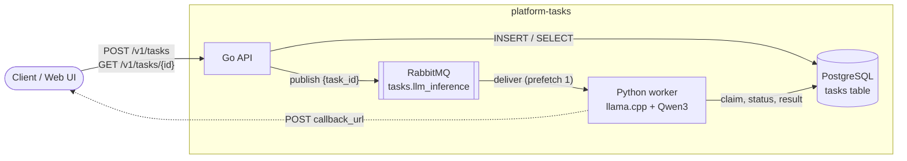
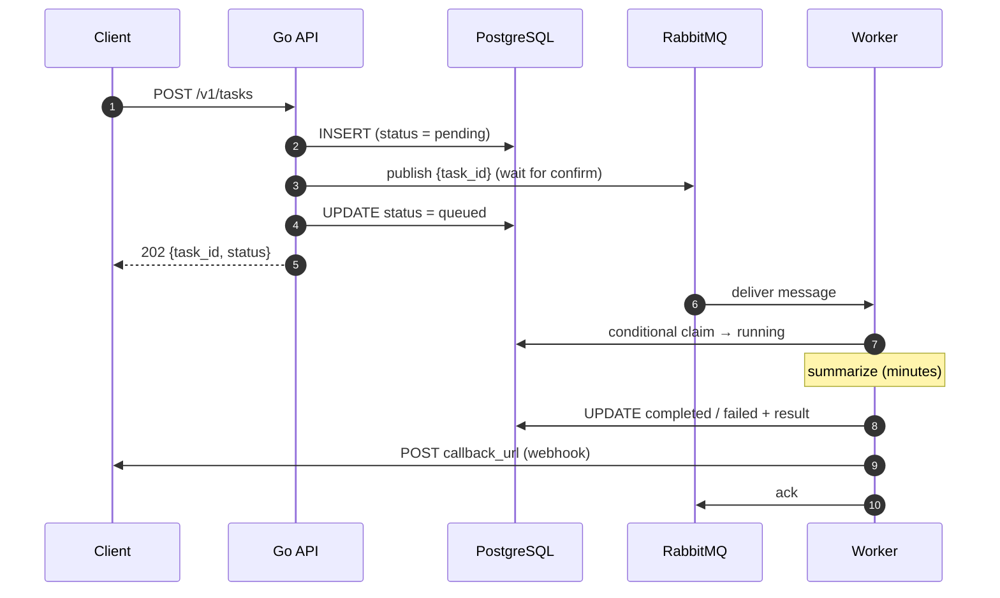
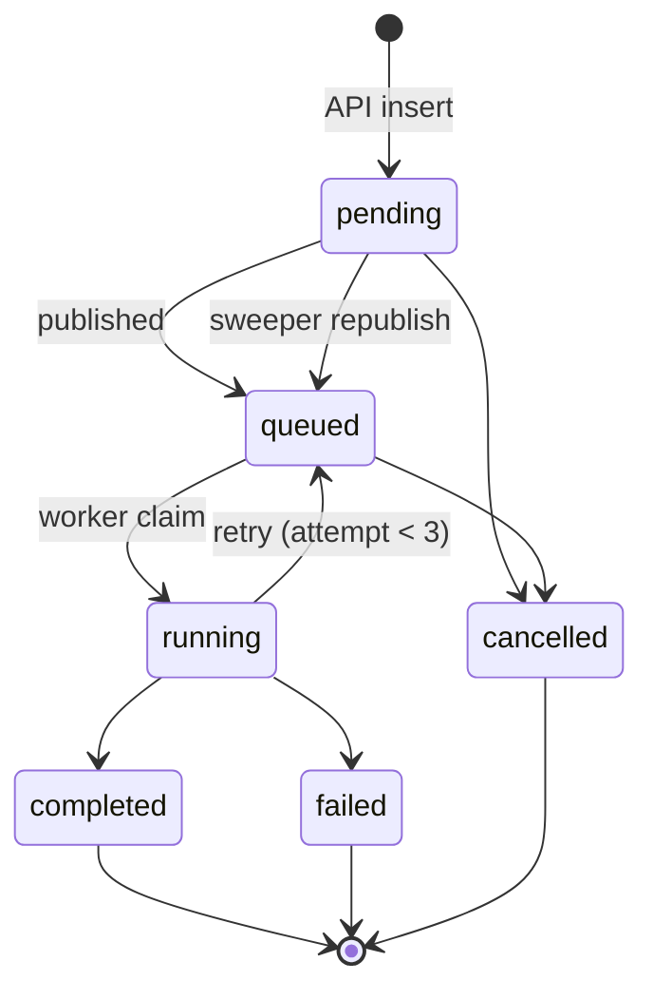

# platform-tasks

Async compute-task platform: a Go API accepts tasks, RabbitMQ queues them, Python workers run LLM inference on CPU, Postgres tracks state, and the client gets a webhook when its task finishes.

## Architecture



## Task lifecycle



## States



## Layout

| Path | What |
|---|---|
| `api/` | Go REST API (`cmd/api` entrypoint, `internal/` packages) |
| `api/migrations/` | goose SQL migrations for Postgres |
| `worker/` | Python worker: consumes the queue, runs the model |
| `worker/models/` | GGUF model files (gitignored, copied into the image) |
| `web/` | React dashboard (Vite + TypeScript + Tailwind) |
| `infra/` | Config for third-party services (`rabbitmq.conf`, …) |
| `scripts/` | `dev.sh` (whole stack), `webhook_receiver.py` (prints callbacks) |
| `testdata/` | Sample inputs |
| `docs/plan/` | Project context, build plan, TODO / decision log |
| `docs/guides/` | Step-by-step guides |

## Run locally

```bash
scripts/dev.sh                  # everything: infra, migrations, API (hot reload), web, webhook receiver, worker
scripts/dev.sh --worker local   # worker from worker/.venv instead of Docker (N_THREADS=4)
scripts/dev.sh --worker none    # no worker, tasks stay queued
scripts/dev.sh --keep-infra     # Ctrl+C leaves the Docker containers running
scripts/dev.sh down             # stop everything
```

**Ctrl+C stops everything** (processes and containers). Data is kept in Docker volumes.

| Service | URL |
|---|---|
| RabbitMQ UI | http://localhost:15672 (`app` / `app`) |
| Postgres | `localhost:5433` (`app` / `app`, db `tasks`) |
| API | http://localhost:8080 |
| Web UI | http://localhost:5173 |
